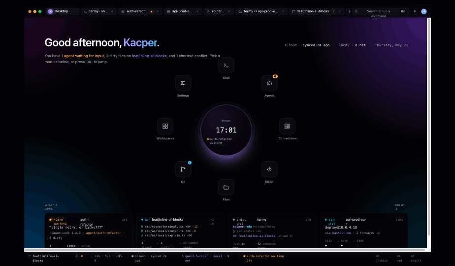
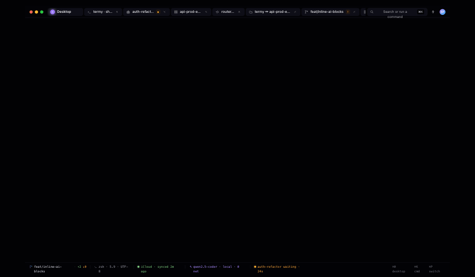

# Termy

> ⚠️ **Early beta — work in progress.** Termy is in active, early-stage development. Many
> features are incomplete, unpolished, or not yet working; the UI is mid-redesign and there
> is substantial functional and visual work remaining. Expect bugs, rough edges, missing
> pieces, and breaking changes. This is **not** a finished product — it's a preview of where
> it's headed. See [`ROADMAP.md`](./ROADMAP.md) for an honest, area-by-area status.

Termy *aims to be* a native, keyboard-first macOS cockpit for a developer's whole workflow —
local and remote — in one private app: a modern terminal with built-in AI assist and
CLI-agent orchestration (Claude Code / Codex), a light editor, git, a file explorer, a full
SSH manager, and an embedded RDP desktop, with private iCloud sync. Today only parts of that
exist (see the roadmap).

**Privacy is the point.** No telemetry. No account. No Termy server. Secrets live only
in the macOS/iCloud Keychain. The built-in AI runs locally. The only network traffic is
what you initiate: SSH/RDP to your hosts, CLI agents with their own auth, and your own
private iCloud sync. Being open-source makes that claim auditable.




*Above: design direction, rendered from the v3 design prototype. The actual app is
mid-implementation and does not look like this yet.*

## Building from source

Termy is a SwiftPM project. It bundles a pinned, statically-linked FreeRDP (which builds
its own OpenSSL + zlib from source), so a first build is slow.

**Prerequisites:** macOS (Apple Silicon), Xcode toolchain (clang/make/perl/git), and
`cmake` ≥ 3.13:

```bash
brew install cmake
```

**Build FreeRDP once (10–40 min; cached afterward), then build & test:**

```bash
./script/build_freerdp.sh   # pinned, offline-after-fetch; populates vendor/freerdp/{include,lib}
swift build
swift test
```

To build and launch the app bundle locally:

```bash
script/build_and_run.sh --verify
```

> **Note on signed releases.** Producing a signed, notarized DMG and publishing Sparkle
> auto-updates requires an Apple Developer account, a Developer ID certificate, a notary
> profile, and the Sparkle EdDSA key — these are **maintainer-only** and not needed to
> build, test, or run an unsigned local build. iCloud sync likewise requires the
> maintainer's iCloud container. See [`CONTRIBUTING.md`](./CONTRIBUTING.md).

## Contributing

Contributions are welcome. Please read [`CONTRIBUTING.md`](./CONTRIBUTING.md) (it covers
the DCO sign-off, the build prerequisites above, and the contributor/maintainer split)
and [`CODE_OF_CONDUCT.md`](./CODE_OF_CONDUCT.md). Security reports: see
[`SECURITY.md`](./SECURITY.md).

## License

Apache License 2.0 — see [`LICENSE`](./LICENSE) and [`NOTICE`](./NOTICE).

## Environment variables

### `TERMY_SIDECAR=1`

When Termy spawns its completion sidecar (a hidden helper zsh per local session), it sets
`TERMY_SIDECAR=1` in the child's environment. Gate slow or interactive-only blocks in your
`.zshrc` on it if needed:

```zsh
if [[ -n "$TERMY_SIDECAR" ]]; then
  return  # skip greetings/banners/heavy init in the helper process
fi
```

This is opt-in — Termy works without any `.zshrc` change.
